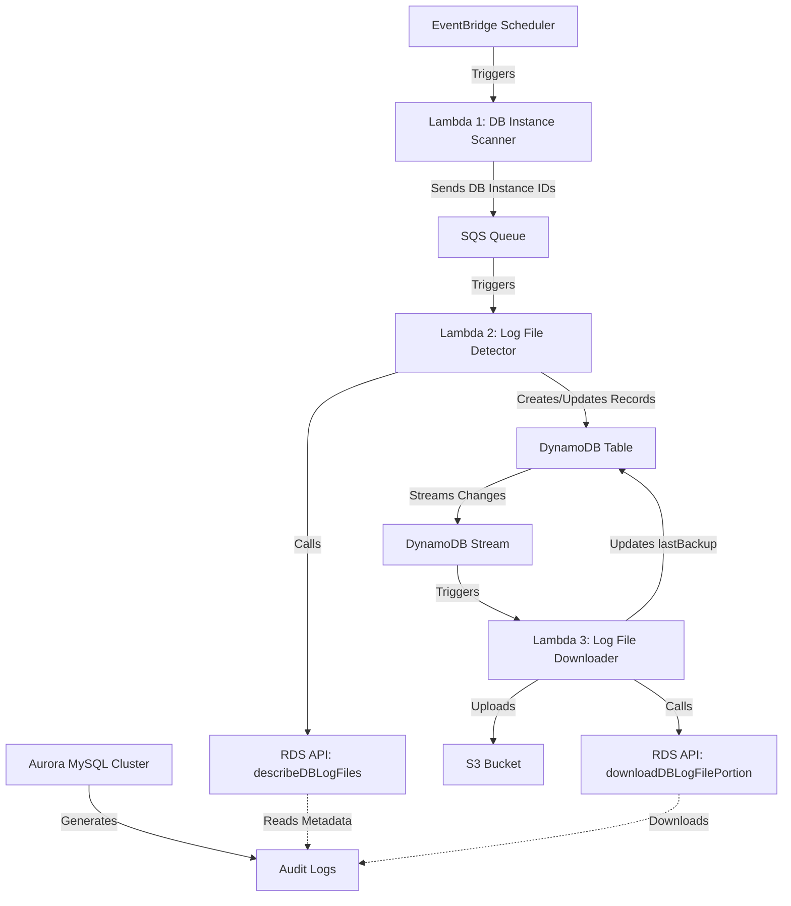

# Aurora Audit Log Backup Lab

This lab provides a production-like environment for testing Aurora MySQL audit log backup solutions. It uses Pulumi with Go to create the necessary AWS infrastructure.

## Architecture

The lab consists of the following components:

- VPC with 1 public subnet and 2 private subnets in different availability zones
- EC2 instance with Amazon Linux 2023 (ARM64) in the public subnet
- Aurora MySQL cluster with 1 primary and 1 replica instance in the private subnets (Graviton-based)
- S3 bucket for storing audit logs
- IAM roles and policies for EC2 and Aurora
- ARM64 compatible instance types (t4g.micro for EC2, t4g.medium for Aurora)

## Project Structure

```
aurora-audit-log-backup-lab/
├── infrastructure/           # Pulumi infrastructure code
│   ├── Pulumi.yaml           # Project configuration
│   ├── Pulumi.dev.yaml       # Stack configuration
│   ├── go.mod                # Go module definition
│   ├── main.go               # Main Pulumi program
│   ├── vpc.go                # VPC, subnets, and networking components
│   ├── ec2.go                # EC2 instance and related resources
│   ├── aurora.go             # Aurora MySQL cluster configuration
│   ├── iam.go                # IAM roles and policies
│   └── s3.go                 # S3 bucket for audit logs
├── scripts/
│   ├── setup_ec2.sh          # EC2 instance setup script
│   ├── setup_sysbench.sh     # Sysbench installation and configuration
│   └── test_audit_logs.sh    # Script to verify audit logs
└── README.md                 # Lab documentation
```

## Prerequisites

- AWS account with appropriate permissions
- AWS CLI configured with access credentials
- Pulumi CLI installed
- Go 1.24 or later installed
- MySQL client installed

## Setup Instructions

### 1. Initialize the Pulumi Project

```bash
# Navigate to the infrastructure directory
cd infrastructure

# Initialize the Go module
go mod tidy

# Login to Pulumi
pulumi login
```

### 2. Configure AWS Authentication

#### Option 1: Use EC2 Instance Role (Recommended)

If you're running on an EC2 instance with an appropriate IAM role attached, Pulumi can automatically use these credentials:

```bash
# Enable EC2 instance role authentication
pulumi config set aws:skipCredentialsValidation true
pulumi config set aws:skipMetadataApiCheck false
```

#### Option 2: Configure AWS Credentials Manually

If you're not running on an EC2 instance or need to use different credentials:

```bash
# Configure AWS credentials
aws configure
# OR
export AWS_ACCESS_KEY_ID=your_access_key
export AWS_SECRET_ACCESS_KEY=your_secret_key
export AWS_REGION=your_region
```

### 3. Configure AWS Region

```bash
# Set the AWS region
pulumi config set aws:region us-east-1  # Change to your preferred region
```

### 4. Deploy the Infrastructure

```bash
# Deploy the infrastructure
pulumi up
```

This will create all the necessary resources in your AWS account. The deployment will take approximately 15-20 minutes to complete.

### 5. Connect to the EC2 Instance

```bash
# Get the EC2 instance public IP
EC2_IP=$(pulumi stack output ec2PublicIp)

# Connect to the EC2 instance
ssh -i /path/to/your/key.pem ec2-user@$EC2_IP
```

### 6. Set Up the Test Environment

```bash
# Run the EC2 setup script
bash /home/ec2-user/scripts/setup_ec2.sh

# Run the sysbench setup script
bash /home/ec2-user/scripts/setup_sysbench.sh
```

## Running Tests

To run the tests and verify the audit logs:

```bash
# Run the test script
bash /home/ec2-user/scripts/test_audit_logs.sh
```

This script will:
1. Run authentication tests
2. Run OLTP workload tests
3. Run schema modification tests
4. Run privilege tests
5. Download and analyze the audit logs from S3
6. Generate a verification report

## Audit Log Configuration

The Aurora MySQL cluster is configured with the following audit log settings:

- `server_audit_events = 'CONNECT,QUERY,TABLE,QUERY_DDL,QUERY_DML,QUERY_DCL'`
- `server_audit_logging = 1`
- `server_audit_logs_upload = 1`
- `server_audit_s3_bucket_name = <your-s3-bucket-name>`
- `server_audit_s3_file_prefix = 'audit-logs'`

This configuration captures all database activities including:
- Connection attempts (CONNECT)
- All queries (QUERY)
- Table access (TABLE)
- Data Definition Language operations (QUERY_DDL)
- Data Manipulation Language operations (QUERY_DML)
- Data Control Language operations (QUERY_DCL)

## Cleanup

To avoid unnecessary costs, clean up the resources when you're done:

```bash
# Navigate to the infrastructure directory
cd infrastructure

# Destroy all resources
pulumi destroy
```

## Troubleshooting

### Audit Logs Not Appearing in S3

If audit logs are not appearing in the S3 bucket:

1. Check the Aurora parameter group to ensure audit logging is enabled
2. Verify that the Aurora cluster has the necessary IAM permissions to write to S3
3. Check the CloudWatch Logs for any error messages
4. Restart the Aurora cluster if necessary

### Connection Issues

If you're having trouble connecting to the Aurora cluster:

1. Verify that the EC2 instance is in the correct VPC and security group
2. Check the security group rules to ensure port 3306 is open
3. Verify that IAM authentication is properly configured
4. Check the Aurora cluster status to ensure it's available

## Additional Resources

- [Aurora MySQL Documentation](https://docs.aws.amazon.com/AmazonRDS/latest/AuroraUserGuide/CHAP_AuroraMySQL.html)
- [Aurora Audit Logging](https://docs.aws.amazon.com/AmazonRDS/latest/AuroraUserGuide/AuroraMySQL.Auditing.html)
- [IAM Database Authentication](https://docs.aws.amazon.com/AmazonRDS/latest/AuroraUserGuide/UsingWithRDS.IAMDBAuth.html)
- [Sysbench Documentation](https://github.com/akopytov/sysbench)

## Aurora Audit Log Backup Architecture

This section describes the architecture for an automated Aurora MySQL audit log backup solution using EventBridge, Lambda, SQS, DynamoDB, and S3.

### Architecture Overview

The solution uses a serverless approach to automatically backup Aurora MySQL audit logs to S3. It efficiently tracks which logs have been backed up and only processes new or changed logs.



### Component Details

#### 1. EventBridge Scheduler
- Scheduled rule to trigger Lambda 1 periodically (e.g., every 15 minutes)
- Ensures regular scanning of DB instances

#### 2. Lambda 1: DB Instance Scanner
- **Input**: None (triggered by EventBridge)
- **Process**:
  - Calls `DescribeDBInstances` API to get all Aurora MySQL instances
  - Filters for instances with audit logging enabled
  - Sends each DBInstanceIdentifier to SQS
- **Output**: DBInstanceIdentifiers to SQS queue

#### 3. SQS Queue
- Decouples the DB instance discovery from log file processing
- Provides buffering if many DB instances are discovered
- Enables automatic retries if Lambda 2 fails

#### 4. Lambda 2: Log File Detector
- **Input**: DBInstanceIdentifier from SQS
- **Process**:
  - Calls `DescribeDBLogFiles` API to get log files for the instance
  - For each log file, checks if it exists in DynamoDB
  - If not exists: Creates new record
  - If exists but changed: Updates record
- **Output**: Creates/updates records in DynamoDB

#### 5. DynamoDB Table
- **Primary Key**: Composite key of DBInstanceIdentifier (Partition) and LogFileName (Sort)
- **Attributes**:
  - DBInstanceIdentifier (String)
  - LogFileName (String)
  - Size (Number)
  - LastWritten (Number)
  - LastBackup (Number, nullable)
- **Stream**: Enabled for inserts and updates

#### 6. Lambda 3: Log File Downloader
- **Input**: DynamoDB stream events (new or updated records)
- **Process**:
  - Calls `DownloadDBLogFilePortion` API to download log files
  - Uploads log files to S3
  - Updates LastBackup timestamp in DynamoDB
- **Output**: Log files in S3, updated DynamoDB records

#### 7. S3 Bucket
- Destination for log backups
- Organized by: `/logs/{db-instance-id}/{log-file-name}`
- Lifecycle policies can be applied for cost optimization

### IAM Permissions

Each Lambda function will need specific IAM permissions:

#### Lambda 1 (DB Scanner)
- `rds:DescribeDBInstances`
- `sqs:SendMessage`

#### Lambda 2 (Log Detector)
- `rds:DescribeDBLogFiles`
- `dynamodb:PutItem`
- `dynamodb:GetItem`
- `dynamodb:UpdateItem`
- `sqs:ReceiveMessage`
- `sqs:DeleteMessage`

#### Lambda 3 (Log Downloader)
- `rds:DownloadDBLogFilePortion`
- `s3:PutObject`
- `dynamodb:UpdateItem`
- `dynamodb:GetItem`

### Considerations and Optimizations

#### Error Handling
- Implement retry mechanisms for API failures
- Use DLQ (Dead Letter Queue) for SQS
- Log errors to CloudWatch Logs

#### Performance
- Use pagination for large result sets
- Optimize Lambda memory allocation
- Consider batching S3 uploads for large log files

#### Cost Optimization
- Adjust EventBridge schedule based on log generation frequency
- Set appropriate SQS message retention
- Configure S3 lifecycle policies for log retention

#### Security
- Encrypt data at rest (S3, DynamoDB)
- Use least privilege IAM permissions
- Consider VPC for Lambda functions if needed