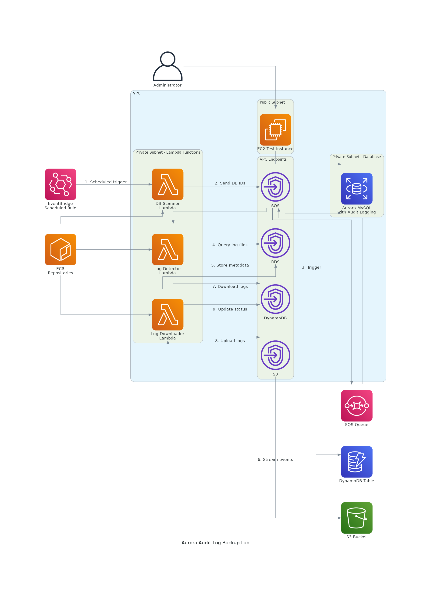

# Aurora Audit Log Backup Lab

This project demonstrates an automated solution for backing up Aurora MySQL audit logs to S3 using serverless components.

## Architecture

The project is organized into three main components:

1. **Fundamental Network Environment**: VPC, subnets, route tables, and VPC endpoints for secure private access
2. **Log Backup Resources**: Lambda functions with versioning, DynamoDB table, SQS queue, and S3 bucket for log backups
3. **Aurora Test Environment**: Aurora MySQL cluster with audit logging enabled and EC2 instance for testing



## Project Structure

The infrastructure code is organized into two separate Pulumi stacks to solve the circular dependency between ECR repositories and Lambda functions:

- `infrastructure/ecr-stack`: Manages only the ECR repositories
- `infrastructure/aurora-log-backup-lab-stack`: Manages all other resources and references the ECR repositories from the ECR stack

## Prerequisites

- AWS CLI configured with appropriate credentials
- Pulumi CLI installed
- Docker installed
- Go 1.20 or later

## Deployment Process

The deployment process is split into multiple steps to handle the circular dependency between ECR repositories and Lambda functions:

### Step 1: Deploy ECR Repositories

First, deploy the ECR stack to create the repositories:

```bash
cd infrastructure/ecr-stack
pulumi stack init dev
pulumi up
```

### Step 2: Build and Push Lambda Images

Build and push the Lambda container images to the ECR repositories with versioning:

```bash
# Build and push the Lambda container images with versioning
make build-and-push-versioned VERSION=v1.0.0
```

This will:
- Build the Lambda container images with the specified version tag
- Push the images to ECR
- Update the Pulumi configuration with the new version

### Step 3: Deploy Main Infrastructure

Deploy the Aurora stack which references the existing ECR repositories:

```bash
cd infrastructure/aurora-log-backup-lab-stack
pulumi stack init dev
pulumi up
```

## Testing the Solution

After deployment, you can connect to the EC2 instance and run the provided test scripts:

1. SSH into the EC2 instance using the public IP output from the deployment:
   ```bash
   ssh -i your-key.pem ec2-user@<ec2-public-ip>
   ```

2. Set up the test database:
   ```bash
   cd ~/scripts
   ./setup_sysbench.sh
   ```

3. Run the audit log tests:
   ```bash
   ./test_audit_logs.sh
   ```

## Cleanup

To destroy all resources:

```bash
# Destroy the Aurora stack first
cd infrastructure/aurora-log-backup-lab-stack
pulumi destroy

# Then destroy the ECR stack
cd ../ecr-stack
pulumi destroy
```

## Configuration

Configuration values are stored in the Pulumi stack configuration files:

- `infrastructure/ecr-stack/Pulumi.dev.yaml`
- `infrastructure/aurora-log-backup-lab-stack/Pulumi.dev.yaml`

You can modify these files to customize the deployment.

## Lambda Versioning

This project implements Lambda versioning and aliases for better deployment control and rollback capabilities. For detailed information, see [LAMBDA-VERSIONING.md](LAMBDA-VERSIONING.md).

Key features:
- Container image versioning with semantic versioning
- Lambda function versioning with Pulumi
- Lambda aliases that point to specific versions
- Configuration-driven versioning in Pulumi.dev.yaml

## Components

### Lambda Functions

1. **DB Scanner**: Scans for Aurora DB instances and sends their IDs to an SQS queue
2. **Log Detector**: Processes DB instance IDs from the queue and detects new audit log files
3. **Log Downloader**: Triggered by DynamoDB streams to download detected log files to S3

All Lambda functions use container images with versioning and aliases for controlled deployments.

### Infrastructure Resources

- VPC with public and private subnets
- S3 VPC Endpoint (accessible only from private subnets)
- DynamoDB VPC Endpoint (accessible only from private subnets)
- RDS VPC Endpoint (accessible only from private subnets)
- SQS VPC Endpoint (accessible only from private subnets)
- Aurora MySQL cluster with audit logging enabled
- EC2 instance for testing
- S3 bucket for audit log backups
- DynamoDB table for tracking log files
- SQS queue for DB instance IDs
- EventBridge rule for scheduling the DB Scanner Lambda

## Makefile Commands

The Makefile provides the following commands for managing Lambda container images:

- `make build`: Build the Lambda container images
- `make get-ecr-urls`: Get the ECR repository URLs from the ECR stack
- `make push-images`: Push the Lambda container images to ECR
- `make clean`: Clean up Docker images
- `make update-pulumi-config`: Update Pulumi config with new image versions
- `make build-and-push-versioned VERSION=v1.0.0`: Build and push images with a specific version tag and update Pulumi config