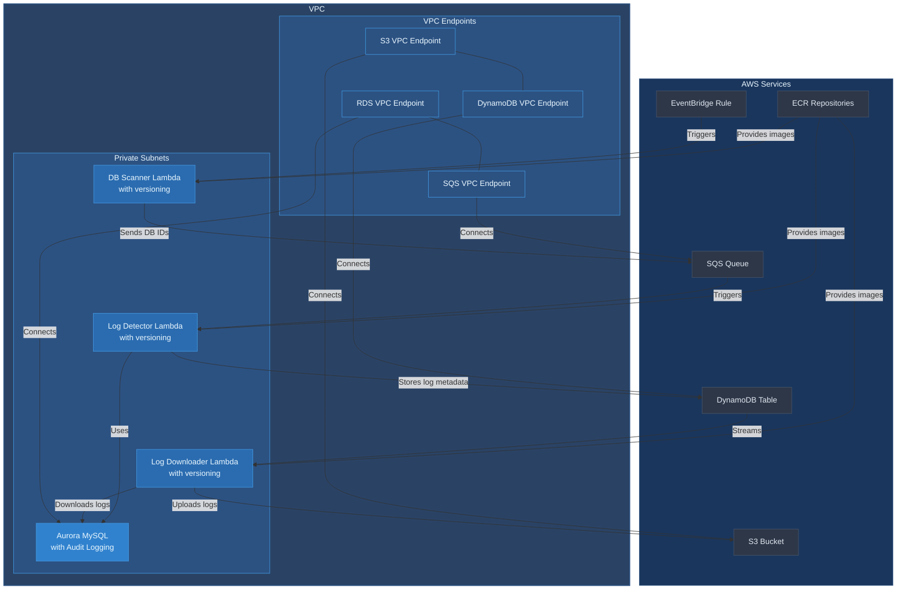
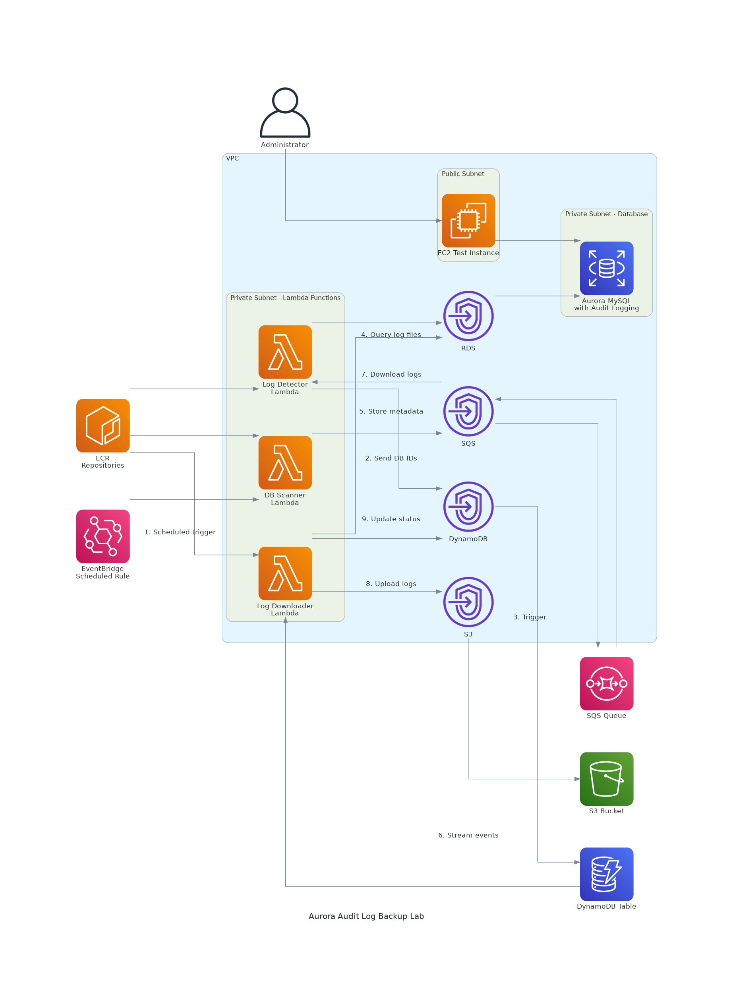
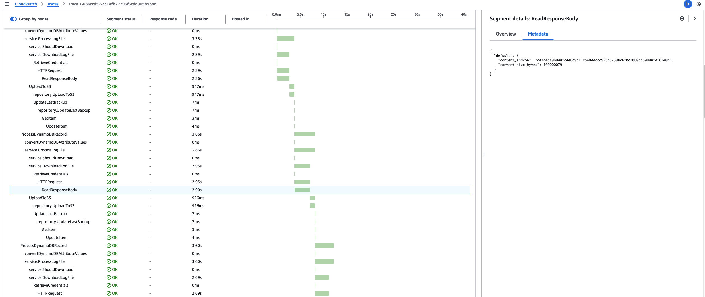
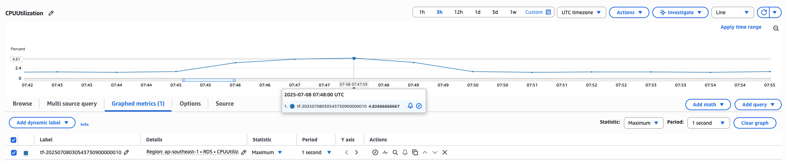
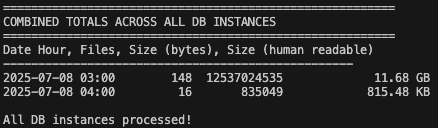
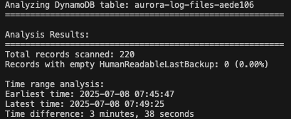

# Aurora Audit Log Backup Lab

This project demonstrates an automated solution for backing up Aurora MySQL audit logs to S3 using serverless components. It's particularly suitable for scenarios requiring long-term storage of database audit logs to meet compliance requirements. If real-time log reading and analysis is needed, AWS's default CloudWatch log approach is recommended. However, if logs are primarily for archival purposes and rarely accessed, this solution can significantly reduce CloudWatch log injection and storage costs.

## Documentation

- [中文介绍文档](aurora-audit-log-backup-lab-introduction-zh.md) - Comprehensive introduction document in Chinese covering project overview, architecture, parameter descriptions, Pulumi installation guide, manual deployment instructions (including ECR repository creation, Docker image building, and VPC endpoint setup), testing procedures, and troubleshooting tips.

## Architecture

The project is organized into three main components:

1. **Fundamental Network Environment**: VPC, subnets, route tables, and VPC endpoints for secure private access
2. **Log Backup Resources**: Lambda functions with versioning, DynamoDB table, SQS queue, and S3 bucket for log backups
3. **Aurora Test Environment**: Aurora MySQL cluster with audit logging enabled

### Architecture Diagram


```mermaid
graph TD
    %% Theme settings - Dark theme with cool colors
    classDef default fill:#2D3748,stroke:#4A5568,color:#E2E8F0
    classDef awsService fill:#1A365D,stroke:#2C5282,color:#EBF8FF
    classDef vpc fill:#2A4365,stroke:#2C5282,color:#EBF8FF,stroke-width:2px
    classDef subnet fill:#2C5282,stroke:#4299E1,color:#EBF8FF
    classDef lambda fill:#2B6CB0,stroke:#4299E1,color:#EBF8FF
    classDef endpoint fill:#2C5282,stroke:#4299E1,color:#EBF8FF
    classDef database fill:#3182CE,stroke:#4299E1,color:#EBF8FF
    
    %% AWS Services section
    subgraph awsServices["AWS Services"]
        ECR["ECR Repositories"]
        EventBridge["EventBridge Rule"]
        SQS["SQS Queue"]
        DynamoDB["DynamoDB Table"]
        S3Bucket["S3 Bucket"]
    end
    
    %% VPC section
    subgraph vpc["VPC"]
        %% VPC Endpoints - 2x2 grid arrangement
        subgraph vpcEndpoints["VPC Endpoints"]
            S3Endpoint["S3 VPC Endpoint"]
            DynamoDBEndpoint["DynamoDB VPC Endpoint"]
            RDSEndpoint["RDS VPC Endpoint"]
            SQSEndpoint["SQS VPC Endpoint"]
            
            %% Arrange in 2x2 grid
            S3Endpoint --- DynamoDBEndpoint
            RDSEndpoint --- SQSEndpoint
            S3Endpoint ~~~ RDSEndpoint
            DynamoDBEndpoint ~~~ SQSEndpoint
        end
        
        %% Private Subnets with Aurora inside
        subgraph privateSubnets["Private Subnets"]
            DBScanner["DB Scanner Lambda\nwith versioning"]
            LogDetector["Log Detector Lambda\nwith versioning"]
            LogDownloader["Log Downloader Lambda\nwith versioning"]
            Aurora["Aurora MySQL\nwith Audit Logging"]
        end
    end
    
    %% Connections
    ECR -- "Provides images" --> DBScanner
    ECR -- "Provides images" --> LogDetector
    ECR -- "Provides images" --> LogDownloader
    
    EventBridge -- "Triggers" --> DBScanner
    DBScanner -- "Sends DB IDs" --> SQS
    SQS -- "Triggers" --> LogDetector
    
    LogDetector -- "Stores log metadata" --> DynamoDB
    DynamoDB -- "Streams" --> LogDownloader
    
    LogDetector -- "Uses" --> Aurora
    LogDownloader -- "Downloads logs" --> Aurora
    LogDownloader -- "Uploads logs" --> S3Bucket
    
    %% VPC Endpoint connections
    S3Endpoint -- "Connects" --> S3Bucket
    DynamoDBEndpoint -- "Connects" --> DynamoDB
    RDSEndpoint -- "Connects" --> Aurora
    SQSEndpoint -- "Connects" --> SQS
    
    %% Apply classes
    class awsServices awsService
    class vpc vpc
    class privateSubnets subnet
    class vpcEndpoints endpoint
    class DBScanner,LogDetector,LogDownloader lambda
    class Aurora database
    class S3Endpoint,DynamoDBEndpoint,RDSEndpoint,SQSEndpoint endpoint
```



## Project Structure

The infrastructure code is organized into five separate Pulumi stacks, deployed in order:

- `infrastructure/ecr-stack`: ECR repositories for Lambda container images
- `infrastructure/network-stack`: VPC, subnets, VPC endpoints
- `infrastructure/aurora-cluster-stack`: Aurora MySQL cluster with audit logging
- `infrastructure/backup-solution-stack`: Lambda functions, DynamoDB, SQS, S3, EventBridge (references network-stack and ecr-stack outputs)
- `infrastructure/ec2-stress-client-stack`: EC2 instance for stress testing

## Prerequisites

- AWS CLI configured with appropriate credentials
- Pulumi CLI installed
- Docker installed
- Go 1.20 or later

## Deployment Process

The deployment process is split into multiple steps to handle the circular dependency between ECR repositories and Lambda functions:

### Step 1: Deploy ECR Repositories

First, deploy the ECR stack to create the repositories:

```bash
cd infrastructure/ecr-stack
pulumi stack init dev
pulumi up
```

### Step 2: Build and Push Lambda Images

Build and push the Lambda container images to the ECR repositories with versioning:

```bash
# Build and push the Lambda container images with versioning
make build-and-push-versioned VERSION=v1.0.0
```

This will:
- Build the Lambda container images with the specified version tag
- Push the images to ECR
- Update the Pulumi configuration with the new version

### Step 3: Deploy Network Infrastructure

```bash
cd infrastructure/network-stack
pulumi stack init dev
pulumi up
```

### Step 4: Deploy Aurora Cluster

```bash
cd infrastructure/aurora-cluster-stack
pulumi stack init dev
pulumi up
```

### Step 5: Deploy Backup Solution

Deploy the backup solution which references the ECR and network stack outputs:

```bash
cd infrastructure/backup-solution-stack
pulumi stack init dev
pulumi up
```

### Step 6: Deploy EC2 Stress Client (Optional)

```bash
cd infrastructure/ec2-stress-client-stack
pulumi stack init dev
pulumi up
```

## Testing the Solution

After deployment, you can connect to the EC2 instance and run the provided test scripts:

1. SSH into the EC2 instance using the public IP output from the deployment:
   ```bash
   ssh -i your-key.pem ec2-user@<ec2-public-ip>
   ```

2. Run the Aurora stress test script:
   ```bash
   cd ~/scripts
   ./aurora_stress_test.sh
   ```

   The script supports various options:
   ```bash
   # Show help information
   ./aurora_stress_test.sh --help
   
   # Setup the database with 50 tables of 1 million rows each
   ./aurora_stress_test.sh --mode setup --writer-endpoint aurora-cluster.example.com --tables 50 --table-size 1000000
   
   # Run high-intensity tests on the writer node only (audit logs will only appear on writer)
   ./aurora_stress_test.sh --mode run --target-instance writer --intensity high --writer-endpoint aurora-cluster.example.com
   
   # Run read-only tests on the reader node (audit logs will only appear on reader)
   ./aurora_stress_test.sh --mode run --target-instance reader --workload-type oltp_read_only --writer-endpoint aurora-cluster.example.com --reader-endpoint aurora-cluster-ro.example.com
   
   # Run custom intensity tests on both nodes (audit logs will appear on both instances)
   ./aurora_stress_test.sh --mode run --target-instance both --intensity custom --threads 100 --duration 600 --writer-endpoint aurora-cluster.example.com --reader-endpoint aurora-cluster-ro.example.com
   
   # Clean up all resources
   ./aurora_stress_test.sh --mode cleanup --writer-endpoint aurora-cluster.example.com
   ```

4. Calculate log sizes for one or multiple DB instances using the Go application:
   ```bash
   # For a single DB instance
   cd ~/scripts/calculate_log_size
   go run main.go -i <db-instance-id>
   
   # For multiple DB instances (with combined totals)
   go run main.go -i <db-instance-id-1>,<db-instance-id-2>,<db-instance-id-3>
   
   # Process all DB instances
   go run main.go -a
   
   # Filter by log type (audit, error, instance, all)
   go run main.go -a -t error
   
   # Show help information
   go run main.go -h
   ```
   
   The Go application provides enhanced features:
   - Filter logs by type (audit, error, instance, all)
   - Process multiple DB instances with comma-separated list
   - Display combined totals across all instances
   - Human-readable size formatting (KB, MB, GB)
   - Verbose output option for debugging
   - AWS region override capability

## Cleanup

To destroy all resources (reverse deployment order):

```bash
# Destroy stacks in reverse order
cd infrastructure/ec2-stress-client-stack
pulumi destroy

cd ../backup-solution-stack
pulumi destroy

cd ../aurora-cluster-stack
pulumi destroy

cd ../network-stack
pulumi destroy

cd ../ecr-stack
pulumi destroy
```

## Manual Deployment Guide

If you prefer to deploy the solution manually without using Pulumi, follow these steps:

### Prerequisites

1. AWS account with administrator privileges
2. VPC and private subnets already created
3. Aurora MySQL cluster already created

### Step 1: Create ECR Repositories

1. Log in to the AWS Console and navigate to the ECR service
2. Click "Create repository"
3. Select "Private" repository type
4. Enter repository names (you need to create three repositories):
   - `db-scanner`
   - `log-detector`
   - `log-downloader`
5. In the "Tag immutability" section, select "Enable" to prevent overwriting image tags
6. In the "Scan settings" section, select "Enable scanning" to automatically scan pushed images
7. Click "Create repository"
8. Repeat these steps for each repository

### Step 2: Build and Push Docker Images

1. Ensure Docker and AWS CLI are installed and AWS credentials are configured
2. Get the ECR login command and execute it:

```bash
aws ecr get-login-password --region <your-region> | docker login --username AWS --password-stdin <your-account-id>.dkr.ecr.<your-region>.amazonaws.com
```

3. Review the Makefile in the project root directory to understand available build commands
4. Build and push all Lambda images with version tags:

```bash
# Set environment variables
export AWS_ACCOUNT_ID=<your-account-id>
export AWS_REGION=<your-region>
export VERSION=v1.0.0

# Build and push all images
make build-and-push-versioned
```

5. Alternatively, build and push each image separately:

```bash
# Build and push DB Scanner image
make build-and-push-dbscanner VERSION=v1.0.0

# Build and push Log Detector image
make build-and-push-logdetector VERSION=v1.0.0

# Build and push Log Downloader image
make build-and-push-logdownloader VERSION=v1.0.0
```

6. Verify images were successfully pushed to ECR repositories:

```bash
aws ecr describe-images --repository-name db-scanner --region <your-region>
aws ecr describe-images --repository-name log-detector --region <your-region>
aws ecr describe-images --repository-name log-downloader --region <your-region>
```

### Step 3: Create VPC Endpoints

#### S3 VPC Endpoint

1. Log in to the AWS Console and navigate to the VPC service
2. In the left navigation bar, click "Endpoints"
3. Click "Create endpoint"
4. In the "Service category" section, select "AWS services"
5. In the search box, enter "s3", then select "com.amazonaws.<your-region>.s3" service
6. Select your VPC
7. In the "Configure route tables" section, select the route tables associated with your private subnets
8. In the "Policy" section, select "Full access"
9. Click "Create endpoint"

#### DynamoDB VPC Endpoint

1. Navigate to the VPC service's "Endpoints" section
2. Click "Create endpoint"
3. In the "Service category" section, select "AWS services"
4. In the search box, enter "dynamodb", then select "com.amazonaws.<your-region>.dynamodb" service
5. Select your VPC
6. In the "Configure route tables" section, select the route tables associated with your private subnets
7. In the "Policy" section, select "Full access"
8. Click "Create endpoint"

#### SQS VPC Endpoint

1. Navigate to the VPC service's "Endpoints" section
2. Click "Create endpoint"
3. In the "Service category" section, select "AWS services"
4. In the search box, enter "sqs", then select "com.amazonaws.<your-region>.sqs" service
5. Select your VPC
6. In the "Subnets" section, select your private subnets
7. In the "Security groups" section, select a security group that allows the required traffic
8. In the "Policy" section, select "Full access"
9. Click "Create endpoint"

#### RDS VPC Endpoint

1. Navigate to the VPC service's "Endpoints" section
2. Click "Create endpoint"
3. In the "Service category" section, select "AWS services"
4. In the search box, enter "rds", then select "com.amazonaws.<your-region>.rds" service
5. Select your VPC
6. In the "Subnets" section, select your private subnets
7. In the "Security groups" section, select a security group that allows the required traffic
8. In the "Policy" section, select "Full access"
9. Click "Create endpoint"

### Step 4: Create S3 Bucket

1. Navigate to the S3 service
2. Click "Create bucket"
3. Enter a bucket name (e.g., `aurora-log-backup-{account-id}`)
4. Select the appropriate region
5. Keep default settings or adjust as needed
6. In the "Server-side encryption" section, select "Enable" and choose "Amazon S3 key (SSE-S3)"
7. Click "Create bucket"
8. After creation, navigate to the bucket's "Management" tab
9. In the "Lifecycle rules" section, click "Create lifecycle rule"
10. Enter a rule name (e.g., `expire-old-logs`)
11. Set expiration time to 90 days
12. Click "Create rule"

### Step 5: Create DynamoDB Table

1. Navigate to the DynamoDB service
2. Click "Create table"
3. Enter a table name (e.g., `aurora-log-files`)
4. Set the partition key to `DBInstanceIdentifier` (type: String)
5. Set the sort key to `LogFileName` (type: String)
6. Click "Create table"
7. After creation, click the table name to enter the table details page
8. In the "Additional settings" tab, find the "Time to Live (TTL)" section
9. Click "Enable TTL"
10. In the TTL attribute field, enter `ExpirationTime`
11. Click "Save"

### Step 6: Create SQS Queue

1. Navigate to the SQS service
2. Click "Create queue"
3. Select "Standard queue"
4. Enter a queue name (e.g., `aurora-db-instances`)
5. In the "Configuration" section, set "Visibility timeout" to 300 seconds
6. Set "Message retention period" to 24 hours (86400 seconds)
7. Click "Create queue"
8. After creation, note the queue's ARN

### Step 7: Create IAM Roles and Policies

Create the necessary IAM roles and policies for each Lambda function:

1. Lambda VPC access policy
2. DB Scanner role and policy
3. Log Detector role and policy
4. Log Downloader role and policy

Each role needs appropriate permissions to access the relevant AWS services and resources.

### Step 8: Create Security Group

Create a security group for Lambda functions, allowing required outbound traffic.

### Step 9: Create Lambda Functions

Create three Lambda functions:

1. DB Scanner Lambda
2. Log Detector Lambda
3. Log Downloader Lambda

Each function should use the appropriate container image, memory settings, timeout settings, environment variables, and IAM role.

### Step 10: Create Event Source Mappings

#### SQS Event Source Mapping for Log Detector

1. Navigate to the Lambda service, select the Log Detector function
2. Click "Add trigger", select "SQS"
3. Select the previously created SQS queue
4. Set batch size to 10 (or adjust as needed)
5. Click "Add"

#### DynamoDB Event Source Mapping for Log Downloader

1. Navigate to the Lambda service, select the Log Downloader function
2. Click "Add trigger", select "DynamoDB"
3. Select the previously created DynamoDB table
4. Set "Starting position" to "Latest"
5. Set batch size to 10 (or adjust as needed)
6. Click "Add"

### Step 11: Create EventBridge Rule

1. Navigate to the EventBridge service
2. Click "Create rule"
3. Enter a rule name (e.g., `aurora-db-scanner-schedule`)
4. Select "Schedule" as the rule type
5. Set the schedule expression (e.g., `rate(15 minutes)`)
6. In the "Targets" section, select "Lambda function"
7. Select the DB Scanner Lambda function
8. Click "Create"

## Configuration

Configuration values are stored in the Pulumi stack configuration files:

- `infrastructure/ecr-stack/Pulumi.dev.yaml`
- `infrastructure/network-stack/Pulumi.dev.yaml`
- `infrastructure/aurora-cluster-stack/Pulumi.dev.yaml`
- `infrastructure/backup-solution-stack/Pulumi.dev.yaml`
- `infrastructure/ec2-stress-client-stack/Pulumi.dev.yaml`

You can modify these files to customize the deployment.

### Pulumi Configuration Parameters

| Parameter | Description | Default Value | Example |
|-----------|-------------|---------------|---------|
| aws:region | AWS region | - | ap-southeast-1 |
| backup-solution:dbScannerMemory | DB Scanner Lambda memory size (MB) | 512 | 512 |
| backup-solution:dbScannerTimeout | DB Scanner Lambda timeout (seconds) | 60 | 60 |
| backup-solution:logDetectorMemory | Log Detector Lambda memory size (MB) | 1024 | 1024 |
| backup-solution:logDetectorTimeout | Log Detector Lambda timeout (seconds) | 300 | 300 |
| backup-solution:logDownloaderMemory | Log Downloader Lambda memory size (MB) | 1024 | 1024 |
| backup-solution:logDownloaderTimeout | Log Downloader Lambda timeout (seconds) | 300 | 300 |
| backup-solution:sqsVisibilityTimeout | SQS message visibility timeout (seconds) | 300 | 300 |
| backup-solution:lambdaBatchSize | Lambda event source mapping batch size | 10 | 10 |
| backup-solution:eventBridgeSchedule | EventBridge rule schedule expression | rate(15 minutes) | rate(15 minutes) |
| backup-solution:s3LogPrefix | S3 log file prefix | aurora-logs | aurora-logs |
| backup-solution:publishLambdaVersions | Whether to publish Lambda versions | true | true |
| backup-solution:backupLogTypes | Log types to backup (comma-separated) | audit | audit,error,instance |
| backup-solution:instanceEngine | DB instance engine types to process (comma-separated) | aurora-mysql | aurora-mysql,aurora-postgresql |
| backup-solution:blackList | DB instance IDs to exclude (comma-separated) | - | instance1,instance2 |
| backup-solution:ttlDays | DynamoDB record TTL days | 2 | 3 |
| backup-solution:dbScannerImageVersion | DB Scanner image version | - | v1.0.6 |
| backup-solution:logDetectorImageVersion | Log Detector image version | - | v1.0.6 |
| backup-solution:logDownloaderImageVersion | Log Downloader image version | - | v1.0.6 |
| backup-solution:environment | Environment name | dev | dev |
| backup-solution:owner | Owner | - | zzhe |
| backup-solution:project | Project name | - | aurora-audit-log-backup-lab |

### Lambda Environment Variables

#### DB Scanner Lambda

| Environment Variable | Description | Default Value | Example |
|---------------------|-------------|---------------|---------|
| SQS_QUEUE_URL | SQS queue URL | - | https://sqs.ap-southeast-1.amazonaws.com/123456789012/aurora-db-instances |
| LOG_LEVEL | Log level | error | debug |
| INSTANCE_ENGINE | DB instance engine types to process (comma-separated) | aurora-mysql | aurora-mysql,aurora-postgresql |
| BLACK_LIST | DB instance IDs to exclude (comma-separated) | - | instance1,instance2 |

#### Log Detector Lambda

| Environment Variable | Description | Default Value | Example |
|---------------------|-------------|---------------|---------|
| DYNAMODB_TABLE_NAME | DynamoDB table name | - | aurora-log-files |
| LOG_LEVEL | Log level | error | debug |
| BACKUP_LOGS | Log types to backup (comma-separated) | audit | audit,error,instance |
| TTL_DAYS | DynamoDB record TTL days | 5 | 3 |

#### Log Downloader Lambda

| Environment Variable | Description | Default Value | Example |
|---------------------|-------------|---------------|---------|
| DYNAMODB_TABLE_NAME | DynamoDB table name | - | aurora-log-files |
| S3_BUCKET_NAME | S3 bucket name | - | aurora-log-backup-123456789012 |
| S3_PREFIX | S3 log file prefix | aurora-logs | aurora-logs |
| LOG_LEVEL | Log level | error | debug |
| TTL_DAYS | DynamoDB record TTL days | 5 | 3 |

### Log Backup Configuration

The Log Detector Lambda can be configured to backup different types of logs using the `backupLogTypes` configuration parameter in `Pulumi.dev.yaml`:

```yaml
aurora-audit-log-backup-lab:backupLogTypes: "audit,error,instance"
```

This parameter accepts a comma-separated list of log types to backup:
- `audit`: Backup audit logs (files starting with "audit" or "audit/")
- `error`: Backup error logs (files starting with "error" or "error/")
- `instance`: Backup instance logs (files starting with "instance" or "instance/")

By default, only audit logs are backed up if this parameter is not specified.

## Lambda Versioning

This project implements Lambda versioning and aliases for better deployment control and rollback capabilities. For detailed information, see [LAMBDA-VERSIONING.md](LAMBDA-VERSIONING.md).

Key features:
- Container image versioning with semantic versioning
- Lambda function versioning with Pulumi
- Lambda aliases that point to specific versions
- Configuration-driven versioning in Pulumi.dev.yaml

## Components

### Lambda Functions

1. **DB Scanner**: Scans for Aurora DB instances and sends their IDs to an SQS queue
2. **Log Detector**: Processes DB instance IDs from the queue and detects new audit log files
3. **Log Downloader**: Triggered by DynamoDB streams to download detected log files to S3

All Lambda functions use container images with versioning and aliases for controlled deployments.

#### Lambda Function Architecture

The Lambda functions follow a clean architecture approach with:

- **Directory Structure**: Organized into `cmd/`, `internal/`, and `pkg/` directories
- **Separation of Concerns**: Implemented with handler, service, and repository layers
- **Dependency Injection**: Used for AWS clients and services
- **Structured Logging**: Enhanced with zap logger
- **X-Ray Tracing**: Detailed subsegments and annotations for observability
- **Error Handling**: Custom error types and wrapping
- **AWS SDK v6**: Using the latest version of the AWS SDK

### Infrastructure Resources

- VPC with public and private subnets
- S3 VPC Endpoint (accessible only from private subnets)
- DynamoDB VPC Endpoint (accessible only from private subnets)
- RDS VPC Endpoint (accessible only from private subnets)
- SQS VPC Endpoint (accessible only from private subnets)
- Aurora MySQL cluster with audit logging enabled
- EC2 instance for testing
- S3 bucket for audit log backups
- DynamoDB table for tracking log files
- SQS queue for DB instance IDs
- EventBridge rule for scheduling the DB Scanner Lambda

## Recent Improvements

### Enhanced Observability and Error Handling

- **AWS X-Ray Integration**: Comprehensive tracing with segments and subsegments throughout the execution flow
- **Performance Metrics**: Timing data for critical operations
- **Contextual Logging**: Rich logging with trace IDs and operation metadata
- **Error Correlation**: Linking errors to specific operations and inputs

### Bug Fixes

- **S3 Checksum Format**: Fixed S3 uploads by converting SHA256 checksums from hexadecimal to base64 format
- **X-Ray Context Propagation**: Ensured proper context propagation for X-Ray subsegments
- **Lambda Optimization**: Removed unnecessary EC2/ECS initialization code for Lambda-only environments

### Utility Script Enhancements

- **Go Implementation**: Rewrote `calculate_log_size.sh` in Go for better performance and features
- **Flag-based CLI**: Implemented comprehensive command-line flags with short and long forms
- **Log Type Filtering**: Added support for filtering logs by type (audit, error, instance, all)
- **Multi-DB Instance Support**: Process multiple DB instances in a single run with comma-separated list
- **Combined Totals**: Aggregated hourly totals across all DB instances
- **Human-readable Formatting**: Automatic conversion of sizes to appropriate units (KB, MB, GB)
- **Improved Output Format**: Clear separation of results by DB instance with better formatting
- **File Count Display**: Added log file count information in the output
- **Verbose Mode**: Added detailed output option for debugging purposes
- **Region Override**: Support for specifying AWS region via command-line flag

### New Utility Scripts

- **DynamoDB Log Size Calculator**: Added `calculate_ddb_log_size` tool to analyze DynamoDB tables:
  - Check for empty `HumanReadableLastWritten` attributes
  - Calculate time difference between min and max timestamps
  - Provide detailed statistics on table contents

- **DynamoDB Record Deletion Tool**: Added `delete_ddb_records` tool for efficient table cleanup:
  - Parallel processing with configurable worker count
  - Batch deletion with configurable batch size
  - Dry run mode for testing without actual deletion
  - Progress reporting and error handling

## Performance Testing

### Aurora MySQL Audit Logs

According to [AWS documentation](https://docs.aws.amazon.com/AmazonRDS/latest/AuroraUserGuide/USER_LogAccess.MySQL.LogFileSize.html), Aurora MySQL audit logs are rotated when the file size reaches 100 MB, and removed after 24 hours.

Our performance testing with the LogDownloader Lambda function showed:

- Downloading a single audit log with maximum size (100 MB) takes approximately 3 seconds
- Uploading the log file to S3 takes approximately 1 second



- CPU utilization increases by approximately 4% during the process



- Downloading 12 GB of audit logs (164 files) from 2 DB instances takes 3 minutes and 38 seconds





These metrics demonstrate that the solution is efficient and can handle the maximum log file size within reasonable time and resource constraints, even when processing multiple log files in parallel. The solution also scales well when processing large volumes of log files across multiple DB instances.

### Enhanced Aurora Stress Testing

The project now includes an enhanced unified stress testing script (`aurora_stress_test.sh`) that combines setup, test execution, and cleanup functionality with the following features:

- **Unified Workflow**: Single script with different execution modes:
  ```bash
  ./aurora_stress_test.sh --mode <setup|run|cleanup|all> --writer-endpoint <writer-endpoint> [--reader-endpoint <reader-endpoint>]
  ```

- **Instance Targeting**: Direct stress tests to specific Aurora instances and control audit logging:
  ```bash
  ./aurora_stress_test.sh --target-instance <writer|reader|both> --writer-endpoint <writer-endpoint> --reader-endpoint <reader-endpoint>
  ```
  - When targeting a specific instance (writer or reader), audit logs will only be generated on that instance
  - When targeting both instances, audit logs will be generated on both instances
  - Audit logging settings are automatically reset during cleanup

- **Workload Type Selection**: Run specific types of tests:
  ```bash
  ./aurora_stress_test.sh --workload-type oltp_read_only,oltp_read_write --writer-endpoint <writer-endpoint>
  ```

- **Workload Intensity Control**: Predefined intensity levels with different parameter sets:
  ```bash
  ./aurora_stress_test.sh --intensity <low|medium|high|extreme> --writer-endpoint <writer-endpoint>
  ```
  - **Low**: 5 threads, 5 tables, 100K rows, 60s duration
  - **Medium**: 20 threads, 20 tables, 500K rows, 180s duration
  - **High**: 50 threads, 50 tables, 1M rows, 300s duration
  - **Extreme**: 100 threads, 100 tables, 2M rows, 600s duration

- **Fine-grained Parameter Control**: Customize test parameters:
  ```bash
  ./aurora_stress_test.sh --threads 100 --tables 50 --table-size 1000000 --duration 300 --writer-endpoint <writer-endpoint>
  ```

- **Table Consistency Check**: Automatically adjusts if requested tables don't exist

### Audit Log Generation Features

The enhanced stress test script now includes dedicated features for generating audit logs:

- **Audit Log Focus Mode**: Enable intensive audit log generation:
  ```bash
  ./aurora_stress_test.sh --audit-log-focus --writer-endpoint <writer-endpoint>
  ```

- **DDL Operations**: Automatically generates schema changes (CREATE, ALTER, DROP) at configurable intervals:
  ```bash
  ./aurora_stress_test.sh --audit-log-focus --ddl-frequency 15 --writer-endpoint <writer-endpoint>
  ```

- **User Management Operations**: Performs DCL operations (CREATE USER, GRANT, REVOKE) to generate additional audit logs:
  ```bash
  ./aurora_stress_test.sh --audit-log-focus --writer-endpoint <writer-endpoint>
  ```

- **Selective Operation Control**: Enable or disable specific types of operations:
  ```bash
  ./aurora_stress_test.sh --audit-log-focus --no-schema-changes --no-user-operations --writer-endpoint <writer-endpoint>
  ```

- **Multiple Workload Types**: Run all available workload types in sequence:
  ```bash
  ./aurora_stress_test.sh --workload-type all --audit-log-focus --writer-endpoint <writer-endpoint>
  ```

### Example: Maximum Audit Log Generation

To generate the maximum amount of audit logs:

```bash
./aurora_stress_test.sh \
  --mode all \
  --target-instance both \
  --intensity extreme \
  --audit-log-focus \
  --ddl-frequency 10 \
  --workload-type all \
  --writer-endpoint your-aurora-cluster-endpoint.region.rds.amazonaws.com \
  --reader-endpoint your-aurora-cluster-ro-endpoint.region.rds.amazonaws.com
```

This will:
- Set up the database environment
- Run all workload types with extreme intensity (100 threads, 100 tables)
- Generate continuous DDL operations every 10 seconds
- Create and manage users to generate DCL audit events
- Perform intensive DML operations on dedicated audit tables
- Target both writer and reader instances
- Clean up all resources when complete

### Testing High Intensity on Both Reader and Writer Instances

To run high-intensity tests on both reader and writer instances of your Aurora cluster, follow these steps:

#### Step 1: Setup the Environment

First, set up the test environment by creating the necessary database and tables:

```bash
./aurora_stress_test.sh \
  --mode setup \
  --writer-endpoint your-aurora-cluster-endpoint.region.rds.amazonaws.com \
  --tables 50 \
  --table-size 1000000
```

This will:
- Connect to your Aurora writer instance
- Create a test database named `sysbench_test`
- Create a test user `sysbench` with password `sysbench123`
- Create 50 tables with 1 million rows each

#### Step 2: Run High-Intensity Tests on Both Instances

After the setup is complete, run the high-intensity test on both reader and writer instances:

```bash
./aurora_stress_test.sh \
  --mode run \
  --target-instance both \
  --intensity high \
  --workload-type oltp_read_write \
  --writer-endpoint your-aurora-cluster-endpoint.region.rds.amazonaws.com \
  --reader-endpoint your-aurora-cluster-ro-endpoint.region.rds.amazonaws.com
```

This will:
- Run a high-intensity test (50 threads, 50 tables, 1M rows per table, 300 seconds duration)
- Execute the test on both writer and reader instances
- Use the `oltp_read_write` workload type (mixed read/write operations)

For read-only tests on the reader instance, you can use:

```bash
./aurora_stress_test.sh \
  --mode run \
  --target-instance reader \
  --intensity high \
  --workload-type oltp_read_only \
  --writer-endpoint your-aurora-cluster-endpoint.region.rds.amazonaws.com \
  --reader-endpoint your-aurora-cluster-ro-endpoint.region.rds.amazonaws.com
```

#### Step 3: Clean Up After Testing

When you're done testing, clean up the test database and user:

```bash
./aurora_stress_test.sh \
  --mode cleanup \
  --writer-endpoint your-aurora-cluster-endpoint.region.rds.amazonaws.com
```

#### All-in-One Command

If you want to perform all steps (setup, run, cleanup) in a single command:

```bash
./aurora_stress_test.sh \
  --mode all \
  --target-instance both \
  --intensity high \
  --workload-type oltp_read_write \
  --writer-endpoint your-aurora-cluster-endpoint.region.rds.amazonaws.com \
  --reader-endpoint your-aurora-cluster-ro-endpoint.region.rds.amazonaws.com
```

## Makefile Commands

The Makefile provides the following commands for managing Lambda container images:

- `make build`: Build the Lambda container images
- `make get-ecr-urls`: Get the ECR repository URLs from the ECR stack
- `make push-images`: Push the Lambda container images to ECR
- `make clean`: Clean up Docker images
- `make update-pulumi-config`: Update Pulumi config with new image versions
- `make build-and-push-versioned VERSION=v1.0.0`: Build and push images with a specific version tag and update Pulumi config

## Monitoring and Troubleshooting

### Monitoring Tools

1. **CloudWatch Logs**: View Lambda function logs
2. **X-Ray Tracing**: Analyze detailed execution information
3. **CloudWatch Metrics**: Monitor execution time, memory usage, and error rates
4. **DynamoDB Console**: View records and TTL status in the table
5. **S3 Console**: Verify log files have been successfully uploaded

### Common Issues

1. **Lambda Function Timeouts**: Increase function timeout settings or optimize code
2. **Insufficient Memory**: Increase function memory allocation
3. **Permission Issues**: Check IAM roles and policies
4. **VPC Configuration Problems**: Ensure Lambda functions can access required AWS services
5. **DynamoDB TTL Not Working**: Ensure TTL attribute is correctly set to `ExpirationTime`

## Data Flow

1. EventBridge rule periodically triggers the DB Scanner Lambda
2. DB Scanner Lambda scans Aurora database instances and sends instance IDs to SQS queue
3. Log Detector Lambda receives instance IDs from the queue, detects new log files, and stores metadata in DynamoDB
4. DynamoDB streams trigger the Log Downloader Lambda
5. Log Downloader Lambda downloads log files and uploads them to S3 bucket
6. Log Downloader Lambda updates record status in DynamoDB