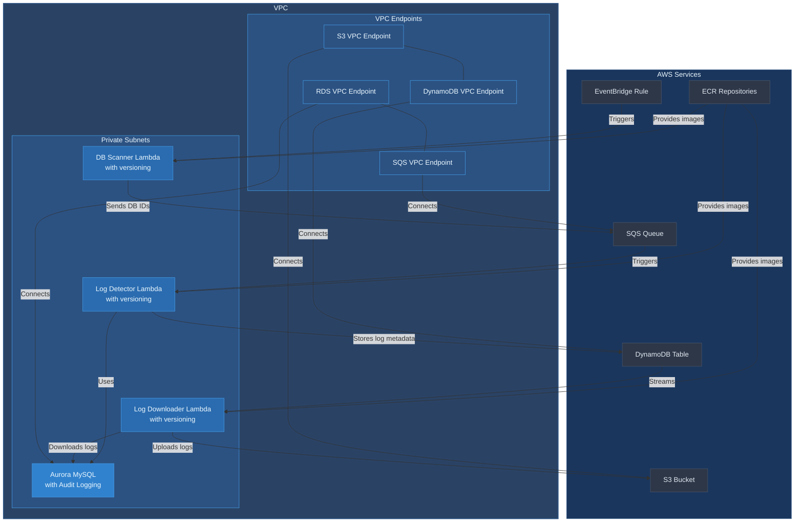

# Aurora Audit Log Backup Lab

This project demonstrates an automated solution for backing up Aurora MySQL audit logs to S3 using serverless components.

## Architecture

The project is organized into three main components:

1. **Fundamental Network Environment**: VPC, subnets, route tables, and VPC endpoints for secure private access
2. **Log Backup Resources**: Lambda functions with versioning, DynamoDB table, SQS queue, and S3 bucket for log backups
3. **Aurora Test Environment**: Aurora MySQL cluster with audit logging enabled

### Architecture Diagram


```mermaid
graph TD
    %% Theme settings - Dark theme with cool colors
    classDef default fill:#2D3748,stroke:#4A5568,color:#E2E8F0
    classDef awsService fill:#1A365D,stroke:#2C5282,color:#EBF8FF
    classDef vpc fill:#2A4365,stroke:#2C5282,color:#EBF8FF,stroke-width:2px
    classDef subnet fill:#2C5282,stroke:#4299E1,color:#EBF8FF
    classDef lambda fill:#2B6CB0,stroke:#4299E1,color:#EBF8FF
    classDef endpoint fill:#2C5282,stroke:#4299E1,color:#EBF8FF
    classDef database fill:#3182CE,stroke:#4299E1,color:#EBF8FF
    
    %% AWS Services section
    subgraph awsServices["AWS Services"]
        ECR["ECR Repositories"]
        EventBridge["EventBridge Rule"]
        SQS["SQS Queue"]
        DynamoDB["DynamoDB Table"]
        S3Bucket["S3 Bucket"]
    end
    
    %% VPC section
    subgraph vpc["VPC"]
        %% VPC Endpoints - 2x2 grid arrangement
        subgraph vpcEndpoints["VPC Endpoints"]
            S3Endpoint["S3 VPC Endpoint"]
            DynamoDBEndpoint["DynamoDB VPC Endpoint"]
            RDSEndpoint["RDS VPC Endpoint"]
            SQSEndpoint["SQS VPC Endpoint"]
            
            %% Arrange in 2x2 grid
            S3Endpoint --- DynamoDBEndpoint
            RDSEndpoint --- SQSEndpoint
            S3Endpoint ~~~ RDSEndpoint
            DynamoDBEndpoint ~~~ SQSEndpoint
        end
        
        %% Private Subnets with Aurora inside
        subgraph privateSubnets["Private Subnets"]
            DBScanner["DB Scanner Lambda\nwith versioning"]
            LogDetector["Log Detector Lambda\nwith versioning"]
            LogDownloader["Log Downloader Lambda\nwith versioning"]
            Aurora["Aurora MySQL\nwith Audit Logging"]
        end
    end
    
    %% Connections
    ECR -- "Provides images" --> DBScanner
    ECR -- "Provides images" --> LogDetector
    ECR -- "Provides images" --> LogDownloader
    
    EventBridge -- "Triggers" --> DBScanner
    DBScanner -- "Sends DB IDs" --> SQS
    SQS -- "Triggers" --> LogDetector
    
    LogDetector -- "Stores log metadata" --> DynamoDB
    DynamoDB -- "Streams" --> LogDownloader
    
    LogDetector -- "Uses" --> Aurora
    LogDownloader -- "Downloads logs" --> Aurora
    LogDownloader -- "Uploads logs" --> S3Bucket
    
    %% VPC Endpoint connections
    S3Endpoint -- "Connects" --> S3Bucket
    DynamoDBEndpoint -- "Connects" --> DynamoDB
    RDSEndpoint -- "Connects" --> Aurora
    SQSEndpoint -- "Connects" --> SQS
    
    %% Apply classes
    class awsServices awsService
    class vpc vpc
    class privateSubnets subnet
    class vpcEndpoints endpoint
    class DBScanner,LogDetector,LogDownloader lambda
    class Aurora database
    class S3Endpoint,DynamoDBEndpoint,RDSEndpoint,SQSEndpoint endpoint
```


## Project Structure

The infrastructure code is organized into two separate Pulumi stacks to solve the circular dependency between ECR repositories and Lambda functions:

- `infrastructure/ecr-stack`: Manages only the ECR repositories
- `infrastructure/aurora-log-backup-lab-stack`: Manages all other resources and references the ECR repositories from the ECR stack

## Prerequisites

- AWS CLI configured with appropriate credentials
- Pulumi CLI installed
- Docker installed
- Go 1.20 or later

## Deployment Process

The deployment process is split into multiple steps to handle the circular dependency between ECR repositories and Lambda functions:

### Step 1: Deploy ECR Repositories

First, deploy the ECR stack to create the repositories:

```bash
cd infrastructure/ecr-stack
pulumi stack init dev
pulumi up
```

### Step 2: Build and Push Lambda Images

Build and push the Lambda container images to the ECR repositories with versioning:

```bash
# Build and push the Lambda container images with versioning
make build-and-push-versioned VERSION=v1.0.0
```

This will:
- Build the Lambda container images with the specified version tag
- Push the images to ECR
- Update the Pulumi configuration with the new version

### Step 3: Deploy Main Infrastructure

Deploy the Aurora stack which references the existing ECR repositories:

```bash
cd infrastructure/aurora-log-backup-lab-stack
pulumi stack init dev
pulumi up
```

## Testing the Solution

After deployment, you can connect to the EC2 instance and run the provided test scripts:

1. SSH into the EC2 instance using the public IP output from the deployment:
   ```bash
   ssh -i your-key.pem ec2-user@<ec2-public-ip>
   ```

2. Run the Aurora stress test script:
   ```bash
   cd ~/scripts
   ./aurora_stress_test.sh
   ```

   The script supports various options:
   ```bash
   # Show help information
   ./aurora_stress_test.sh --help
   
   # Setup the database with 50 tables of 1 million rows each
   ./aurora_stress_test.sh --mode setup --tables 50 --table-size 1000000
   
   # Run high-intensity tests on the writer node only (audit logs will only appear on writer)
   ./aurora_stress_test.sh --mode run --target-instance writer --intensity high
   
   # Run read-only tests on the reader node (audit logs will only appear on reader)
   ./aurora_stress_test.sh --mode run --target-instance reader --workload-type oltp_read_only
   
   # Run custom intensity tests on both nodes (audit logs will appear on both instances)
   ./aurora_stress_test.sh --mode run --intensity custom --threads 100 --duration 600
   
   # Clean up all resources
   ./aurora_stress_test.sh --mode cleanup
   ```

4. Calculate log sizes for one or multiple DB instances using the Go application:
   ```bash
   # For a single DB instance
   cd ~/scripts/calculate_log_size
   go run main.go -i <db-instance-id>
   
   # For multiple DB instances (with combined totals)
   go run main.go -i <db-instance-id-1>,<db-instance-id-2>,<db-instance-id-3>
   
   # Process all DB instances
   go run main.go -a
   
   # Filter by log type (audit, error, instance, all)
   go run main.go -a -t error
   
   # Show help information
   go run main.go -h
   ```
   
   The Go application provides enhanced features:
   - Filter logs by type (audit, error, instance, all)
   - Process multiple DB instances with comma-separated list
   - Display combined totals across all instances
   - Human-readable size formatting (KB, MB, GB)
   - Verbose output option for debugging
   - AWS region override capability

## Cleanup

To destroy all resources:

```bash
# Destroy the Aurora stack first
cd infrastructure/aurora-log-backup-lab-stack
pulumi destroy

# Then destroy the ECR stack
cd ../ecr-stack
pulumi destroy
```

## Configuration

Configuration values are stored in the Pulumi stack configuration files:

- `infrastructure/ecr-stack/Pulumi.dev.yaml`
- `infrastructure/aurora-log-backup-lab-stack/Pulumi.dev.yaml`

You can modify these files to customize the deployment.

### Log Backup Configuration

The Log Detector Lambda can be configured to backup different types of logs using the `backupLogTypes` configuration parameter in `Pulumi.dev.yaml`:

```yaml
aurora-audit-log-backup-lab:backupLogTypes: "audit,error,instance"
```

This parameter accepts a comma-separated list of log types to backup:
- `audit`: Backup audit logs (files starting with "audit" or "audit/")
- `error`: Backup error logs (files starting with "error" or "error/")
- `instance`: Backup instance logs (files starting with "instance" or "instance/")

By default, only audit logs are backed up if this parameter is not specified.

## Lambda Versioning

This project implements Lambda versioning and aliases for better deployment control and rollback capabilities. For detailed information, see [LAMBDA-VERSIONING.md](LAMBDA-VERSIONING.md).

Key features:
- Container image versioning with semantic versioning
- Lambda function versioning with Pulumi
- Lambda aliases that point to specific versions
- Configuration-driven versioning in Pulumi.dev.yaml

## Components

### Lambda Functions

1. **DB Scanner**: Scans for Aurora DB instances and sends their IDs to an SQS queue
2. **Log Detector**: Processes DB instance IDs from the queue and detects new audit log files
3. **Log Downloader**: Triggered by DynamoDB streams to download detected log files to S3

All Lambda functions use container images with versioning and aliases for controlled deployments.

#### Lambda Function Architecture

The Lambda functions follow a clean architecture approach with:

- **Directory Structure**: Organized into `cmd/`, `internal/`, and `pkg/` directories
- **Separation of Concerns**: Implemented with handler, service, and repository layers
- **Dependency Injection**: Used for AWS clients and services
- **Structured Logging**: Enhanced with zap logger
- **X-Ray Tracing**: Detailed subsegments and annotations for observability
- **Error Handling**: Custom error types and wrapping
- **AWS SDK v6**: Using the latest version of the AWS SDK

### Infrastructure Resources

- VPC with public and private subnets
- S3 VPC Endpoint (accessible only from private subnets)
- DynamoDB VPC Endpoint (accessible only from private subnets)
- RDS VPC Endpoint (accessible only from private subnets)
- SQS VPC Endpoint (accessible only from private subnets)
- Aurora MySQL cluster with audit logging enabled
- EC2 instance for testing
- S3 bucket for audit log backups
- DynamoDB table for tracking log files
- SQS queue for DB instance IDs
- EventBridge rule for scheduling the DB Scanner Lambda

## Recent Improvements

### Enhanced Observability and Error Handling

- **AWS X-Ray Integration**: Comprehensive tracing with segments and subsegments throughout the execution flow
- **Performance Metrics**: Timing data for critical operations
- **Contextual Logging**: Rich logging with trace IDs and operation metadata
- **Error Correlation**: Linking errors to specific operations and inputs

### Bug Fixes

- **S3 Checksum Format**: Fixed S3 uploads by converting SHA256 checksums from hexadecimal to base64 format
- **X-Ray Context Propagation**: Ensured proper context propagation for X-Ray subsegments
- **Lambda Optimization**: Removed unnecessary EC2/ECS initialization code for Lambda-only environments

### Utility Script Enhancements

- **Go Implementation**: Rewrote `calculate_log_size.sh` in Go for better performance and features
- **Flag-based CLI**: Implemented comprehensive command-line flags with short and long forms
- **Log Type Filtering**: Added support for filtering logs by type (audit, error, instance, all)
- **Multi-DB Instance Support**: Process multiple DB instances in a single run with comma-separated list
- **Combined Totals**: Aggregated hourly totals across all DB instances
- **Human-readable Formatting**: Automatic conversion of sizes to appropriate units (KB, MB, GB)
- **Improved Output Format**: Clear separation of results by DB instance with better formatting
- **File Count Display**: Added log file count information in the output
- **Verbose Mode**: Added detailed output option for debugging purposes
- **Region Override**: Support for specifying AWS region via command-line flag

### New Utility Scripts

- **DynamoDB Log Size Calculator**: Added `calculate_ddb_log_size` tool to analyze DynamoDB tables:
  - Check for empty `HumanReadableLastWritten` attributes
  - Calculate time difference between min and max timestamps
  - Provide detailed statistics on table contents

- **DynamoDB Record Deletion Tool**: Added `delete_ddb_records` tool for efficient table cleanup:
  - Parallel processing with configurable worker count
  - Batch deletion with configurable batch size
  - Dry run mode for testing without actual deletion
  - Progress reporting and error handling

## Performance Testing

### Aurora MySQL Audit Logs

According to [AWS documentation](https://docs.aws.amazon.com/AmazonRDS/latest/AuroraUserGuide/USER_LogAccess.MySQL.LogFileSize.html), Aurora MySQL audit logs are rotated when the file size reaches 100 MB, and removed after 24 hours.

Our performance testing with the LogDownloader Lambda function showed:

- Downloading a single audit log with maximum size (100 MB) takes approximately 3 seconds
- Uploading the log file to S3 takes approximately 1 second


- CPU utilization increases by approximately 4% during the process


- Downloading 12 GB of audit logs (164 files) from 2 DB instances takes 3 minutes and 38 seconds


These metrics demonstrate that the solution is efficient and can handle the maximum log file size within reasonable time and resource constraints, even when processing multiple log files in parallel. The solution also scales well when processing large volumes of log files across multiple DB instances.

### Enhanced Aurora Stress Testing

The project now includes an enhanced unified stress testing script (`aurora_stress_test.sh`) that combines setup, test execution, and cleanup functionality with the following features:

- **Unified Workflow**: Single script with different execution modes:
  ```bash
  ./aurora_stress_test.sh --mode <setup|run|cleanup|all>
  ```

- **Instance Targeting**: Direct stress tests to specific Aurora instances and control audit logging:
  ```bash
  ./aurora_stress_test.sh --target-instance <writer|reader|both>
  ```
  - When targeting a specific instance (writer or reader), audit logs will only be generated on that instance
  - When targeting both instances, audit logs will be generated on both instances
  - Audit logging settings are automatically reset during cleanup

- **Workload Type Selection**: Run specific types of tests:
  ```bash
  ./aurora_stress_test.sh --workload-type oltp_read_only,oltp_read_write
  ```

- **Workload Intensity Control**: Predefined intensity levels with different parameter sets:
  ```bash
  ./aurora_stress_test.sh --intensity <low|medium|high|custom>
  ```
  - **Low**: 5 threads, 5 tables, 100K rows, 60s duration
  - **Medium**: 20 threads, 20 tables, 500K rows, 180s duration
  - **High**: 50 threads, 50 tables, 1M rows, 300s duration

- **Fine-grained Parameter Control**: Customize test parameters:
  ```bash
  ./aurora_stress_test.sh --threads 100 --tables 50 --table-size 1000000 --duration 300
  ```

- **Table Consistency Check**: Automatically adjusts if requested tables don't exist

## Makefile Commands

The Makefile provides the following commands for managing Lambda container images:

- `make build`: Build the Lambda container images
- `make get-ecr-urls`: Get the ECR repository URLs from the ECR stack
- `make push-images`: Push the Lambda container images to ECR
- `make clean`: Clean up Docker images
- `make update-pulumi-config`: Update Pulumi config with new image versions
- `make build-and-push-versioned VERSION=v1.0.0`: Build and push images with a specific version tag and update Pulumi config